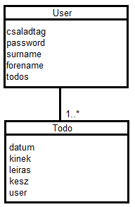

# Családi TODO

## Az 1. beadandó feladat - Kuti Bence - HS74YU

Első beadandóként egy kis webes alkalmazás elkészítése a cél szerveroldali technológiák segítségével. A feladatnak mininálisan tartalmaznia kell:

- legalább két modellt, egy-sok kapcsolatban - [x]
- legalább 1 űrlapot - [x]
- legalább 1 listázó oldalt - [x]
- legyen lehetőség új felvételére - [x]
- legyen lehetőség meglévő szerkesztésére - [x]
- legyen lehetőség meglévő törlésére - [x]
- legyenek benne csak hitelesítés után elérhető funkciók - [x]
- perzisztálás fájlba történjen - [x]
- közzététel Herokun - http://cstodo.herokuapp.com/

A dokumentáció a következő részeket tartalmazza:

- Követelményanalízis
- Tervezés
- Implementáció
- Tesztelés
- Felhasználói dokumentáció

### Követelményanalízis

A követelmény feltárás során felmérik és összegyűjtik a megrendelt szoftverrel szemben támasztott felhasználói követelményeket, elemzik az alkalmazási szakterületet. Részei:

1. Követelmények összegyűjtése: a nyújtandó szolgáltatások ismertetése rövid, szöveges leírásként, sokszor felsorolásként jelenik meg.
    1. Lehessen regisztrálni usereket (családtagokat). Akiknek a regisztrálás után legyen joguk új teendőket felvenni, listázni, keresni, szerkeszteni, törölni és jelezni ha elvégzésre került a teendő.
    2. Esztétikus könnyen kismerhető felhasználói felület.
2. Használatieset-modell
    1. Egy usercsoport aki belépés után éri el az adott menüket kívülről regisztráció és belépés nélkül ne legyen megtekinthető semmi más.
    2. 
	3. Folyamatok pontos menete: legalább 1 folyamat kifejtése.

### Tervezés

1. Architektúra terv
    1. 
    2. Oldaltérkép
		1. Publikus: -Főoldal, -Bejelentkezés, -Regisztráció
		2. Belépett user: -Főoldal, -Bejelentkezés/Kilépés, -Todo lista, -Todo hozzáadása
    3. Végpontok
		* GET ('/login/login')
		* GET ('/login/signup')
		* POST ('/login/signup')
		* POST ('/login/login')
		* GET ('/')
		* GET ('/add')
		* POST ('/add')
		* GET ('/list')
		* GET ('/delete/:id')
		* GET ('/ready/:id')
		* GET ('/todo/:id')
		* POST ('/edit/:id')
2. Felhasználóifelület-modell
	
	
	
	
	
3. Osztálymodell
    1. 
    2. Adatbázisterv
		* TODO
		- datum: 'date',
		- kinek: 'string',
        - leiras: 'string',
        - kesz: 'boolean',
        - user: model: 'user'
		
		* USER
		- csaladtag: 'string',
        - password: 'string',  
        - surname: 'string',
        - forename: 'string',
        - todos: collection: 'todo'
    3. Állapotdiagram
	
4. Dinamikus működés
    1. Szekvenciadiagram

	
### Implementáció

1. Fejlesztői környezet bemutatása
	Cloud 9 - c9.io
		Egy online workspace-t hoz létre - virtuális gépet amin biztosítja a Node.js futtatásához szükséges összes függőséget.
2. Könyvtárstruktúrában lévő mappák funkiójának bemutatása

	
	
	1. bead - Fő modulok
	2. models - Az adatmodellek user és a teendők
	3. node-modules - Node.js modulok amiket használ a kód
	4. test - Tesztek
	5. views - Kinézeti - megjelenítési sémák aloldalanként
	

### Tesztelés

1. Tesztelési környezet bemutatása
	A Mocha egy JavaScript alapú teszkörnyezet Node.js-hez. Könnyebbé és rugalmasabbá teszi a tesztelési folyamatot.
2. Egységtesztek: 
  UserTest
    1. ✓ should create a new user (532ms) - user létrehozása
    2. ✓ should be able to find a user (258ms) - user létezésének vizsgálata
    3. ✓ should throw error for invalid data - hibás adat vizsgálat

  validPassword
    4. ✓ should return true with right password (603ms) 
    5. ✓ should return false with wrong password (488ms)
	
3. Funkcionális felületi tesztek: legalább 1 folyamat tesztelése
	Selenium IDE használatával - Bejelentkezés tesztelése

	
	

### Felhasználói dokumentáció

1. A futtatáshoz ajánlott hardver-, szoftver konfiguráció
	Böngészőben futó alkalmazás nincs különösebb hardver igénye.
	Ajánlott szoftver - Google Chrome, Firefox, Opera, Safari
	
2. Telepítés lépései: hogyan kerül a Githubról a célgépre a program
	git clone https://github.com/slinkyone/Alkfejlbead1
	Telepítés meglévő fileok elhejetése majd konzolban npm -install parancs-al lefut a telepítés. node index-el pedig elindul a program
	Az app telepítve megtalálható az alábbi linken: http://cstodo.herokuapp.com/ és regisztráció után szabadon használható

3. A program használata
	A regisztráció és belépés után lehetőségünk van teendő létrehozására a Hozzáadás menüpontban a teendő leírásának megadásával és az elvégzendő nevének kiválasztásával. Csak regisztrált tagok közül választhatunk.
	A Listázás menüpontban láthatjuk az elvégzedő teendőket, kereshetünk, megtekinthetjük/módosíthatjuk, törölhetjük és elvégzetté tehetjük.
	Példa user: Anya	password: asd123
	
